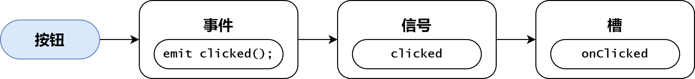

# Notes 笔记

**QT框架功能描述** <p>
QT 框架中的模块分为两大类:
- ***QT基本模块(Qt Essentials) :*** 提供了 Qt 在所有平台上的基本功能
- ***QT附加模块(Qt Add-Ons) :*** 实现了一些特定功能的模块

| 模块 | 描述 |
| :-: | :-: |
| `Qt Core` | Qt 框架的核心, 定义了元对象系统 |
| `Qt GUI` | 设计 GUI 界面的基础类, 包括事件处理、文字处理等 |
| `Qt Widgets` | 提供用于创建 GUI 的各种界面组件类 |
| `Qt D-Bus` | D-Bus 是用于实现进程间通信(Inter Process Communication, IPC) 和 远程过程调用(Remote Procedure Call, RPC)的一种通信协议 |
| `Qt Test` | 提供一些对应用程序和库进行单元测试的类 |
| `Qt QML` | 提供用 QML 编程的框架, 定义了 QML 和基础引擎 |
| `Qt Quick` | 用于开发 QML 应用程序的标准库, 提供创建 UI 的一些基本类型 |
| `Qt Quick Controls` | 提供一套基于 Qt Quick 的控件,可用于创建复杂的UI |
| `Qt Quick Dialogs` | 提供通过 QML 使用系统对话框的功能 |
| `Qt Quick Layouts` | 提供用于管理界面布局的QML类型 |
| `Qt Quick Test` | 提供 QML 应用程序的单元测试框架 |

**Object 类**
- **元对象 (Meta Object) :** 每个 QObject及其子类的实例都有一个元对象 (静态变量 staticMetaObject)  函数 `metaObject()` 可以返回它的指针
- **类型信息 :** QObject的 `inherits()` 函数可以判断继承关系 
- **动态翻译 :** 函数 `tr()` 返回一个字符串的翻译版本
- **对象树 :** 表示对象间从属关系的树状结构 QObject 提供了 `parent()`、`children()`、`findChildren()` 等函数, 当对象树中的某个对象被删除时, 它的子对象也将被删除
- **信号和槽 :** 对象间的通信机制 
- **属性系统 :** 可以使用宏 `Q_PROPERTY` 定义属性, QObject 的`setProperty()` 会设置属性的值或定义动态属性; `property()`函数会返回属性的值

**QT 父窗口**
- 创建控件时, 可以指定停靠在某个父窗口上面, 这时控件将作为子窗口被束缚在其父窗口的内部, 并伴随父窗口一起移动、隐藏、显示和关闭; 否则该控件将作为独立窗口显示在屏幕上, 且游离于其它窗口之外
- QWidget及其子类的对象可以做为其它控件的父窗口常用的父窗口类有如下三个
  - `QWidget`
  - `QMainWindow` 主窗口, QWidget的直接子类
  - `QDialog` 对话框, QWidget的直接子类
- 父窗口的析构函数回自动销毁其所有的子窗口对象, 因此即使子窗口对象是通过 `new` 操作符动态创建的, 可以不显式的执行 `delete` 操作, 而且不用担心内存泄漏的问题, 只要保证父窗门对象被正确销毁, 其子窗口也将随之被销毁
- 设置窗口的位置和大小
  - `void move(int x, int y);`
  - `void resize(int x, int y);`

**QT 信号与槽**
- 什么是信号和槽
  - 信号和槽是 QT 自定义的一种通信机制, 实现对象之间的数据交互
  - 当用户或系统触发了一个动作, 导致某个控件的状态发生了改变, 该控件就会发射一个信号, 即调用其类中一个特定的成员函数(信号), 同时还可能携带有必要的参数
  - 槽和普通的成员函数几乎没有太多区别, 可以是公有的、保护的或私有的, 可以被重载也可以被覆盖, 其参数可以是任意类型, 并可以像普通成员函数一样调用
  - 槽函数与普通成员函数的差别并不在于其语法特性, 而在于其功能, 槽函数更多体现为对某种特定信号的处理, 可以将槽和其它对象信号建立连接, 这样当发射信号时, 槽函数将被触发和执行, 进而来完成具体功能 
- **信号的定义**
  ```
  class X : public QObject {    // X 类必须派生自 QObject 类, 或其子类
                                // 可以是 QObject 的子类, 也可以是其子类的子类
      Q_OBJECT                  // 使用信号与槽机制必须添加 Q_OBJECT 宏
  signals:                      // 不需添加任何访问修饰符
      void signal_func(...);    // 信号函数
  };
  ```
  ***注意 :*** 信号函数只需要声明, 不能写定义
- **槽函数的定义**
  ```
  class X : public QObject {
      Q_OBJECT
  public slots:
      void slot_func(...) { ... }   // 槽函数
  };
  ```
  ***注意 :*** 槽函数可以连接到某个信号上, 当信号被发射时, 槽函数将被触发, 另外槽函数也可以被当作普通的成员函数被直接调用
- 信号与槽的连接 <p>
  `QObject::connect(const QObject* sender, const char* signal, const QObject* receiver, const char* method);`
  - 参数
    - `sender` 信号发送的对象指针
    - `signal` 要发送的信号函数, 可以用 `SIGNAL(...)` 宏进行类型转换
    - `receiver` 信号的接收对象指针
    - `method` 接收信号后要执行的槽函数, 可以使用 `SLOT(...)` 宏进行类型转换
- 信号与槽连接的语法要求
  - 信号与槽参数要一致 <p>
    `QObject::connect(A, SIGNAL(sigfunc(int)), B, SLOT(slotfunc(int)));` **-> 正确** <p>
    `QObject::connect(A, SIGNAL(sigfunc(int)), B, SLOT(slotfunc(int, int)));` **-> 错误**
  - 可以有缺省参数 <p>
    `QObject::connect(A, SIGNAL(sigfunc(int)), B, SLOT(slotfunc(int, int = 0)));` **-> 正确**
  - 信号函数的参数可以多于槽函数, 多余的参数将被忽略
    `QObject::connect(A, SIGNAL(sigfunc(int, int)), B, SLOT(slotfunc(int)));` **-> 正确**
- 信号与槽连接的应用
  - 一个信号可以被连接到多个槽 <p>
    `QObject::connect(A, SIGNAL(sigfunc(int)), B1, SLOT(slotfunc1(int)));` <p>
    `QObject::connect(A, SIGNAL(sigfunc(int)), B2, SLOT(slotfunc2(int)));`
  - 多个信号可以被连接到一个槽  <p>
    `QObject::connect(A1, SIGNAL(sigfunc1(int)), B, SLOT(slotfunc(int)));` <p>
    `QObject::connect(A2, SIGNAL(sigfunc2(int)), B, SLOT(slotfunc(int)));`
  - 两个信号可以直接连接(信号级连) - 了解即可 <p>
    `QObject::connect(A1, SIGNAL(sigfunc1(int)), A2, SIGNAL(sigfunc2(int)));`

**面向对象的 QT 编程** <p>
***基于对象的 QT 编程***
- 完全不使用任何面向对象技术, 而只是利用Qt所提供的类创建对象, 并诉用对象的接口以满足用户的需求是可能的, 但这样构建的应用程序其功能必然是十分有限的
- 首先, Qt类保护成员中的诸多实现无法在类的外部被复用, Qt试图通过多态实现的很多机制, 如事件处理, 完全无法使用
- 再次, Qt提供的信号和槽不可能满足用户所有的需求, 自定义信号和槽需要面向对象技术
- 最后, Qt Designer、Qt Creator等工具链都在以面向对象的方式使用Qt, 不能反其道而行之

**QT Designer (QT 设计师)**
- 在指定目录下输入 `designer` 进入 QT Designer, 进入 QT Designer 后可以进行可视化的 UI 编辑, 当成功布局好 UI 后按住 `ctrl + S` 进行重命名保存
- 使用 `uic` 进行编译, 将 XML 文件转换为 C++ 头文件
- 使用头文件中自动生成的界面相关代码, 完成代码编写
  - **方法 1:** 通过继承方式, 将界面相关代码继承过来直接使用
  - **方法 2:** 通过组合方式, 添加一个界面类的成员变量(ui), 通过该成员访问界面相关的代码, 实际开发中, 推荐这种方法

**QT Creator (QT 创造器)**
- 在任意目录下, 执行 `qtcreator` , 进入 QT 集成开发环境界面(Windows 下需要将对应的环境变量进行添加)
- 在欢迎界面选择 "New Project" 创建新项目

**QT 事件**
- 事件的概念
  - 在Qt中, 是以事件驱动 UI工具集, 包括信号与槽都依赖于 Qt 的事件处理机制
  - 通常事件是由窗口系统或者 Qt 自身产生的, 用以响应所发生的各类事情, 比如用户按下并释放了键盘或者鼠标、窗口因缩放而需要重绘、定时器到期而应有所动作
  - 如下图可以看到事件比信号更原始, 一个下压式按钮首先感受到的是鼠标事件, 在进行必要的处理以产生按钮下沉继而弹起的视觉效果之后, 才会发射 `clicked()` 信号


- **如何处理事件**
  - 在 Qt 中, 事件被封装成对象, 所有的事件对象类型都继承自抽象类 `QEvent` , 当事件发生时, 首先被调用的是 `QObject` 类中的虚函数`event()` , 其参数 `QEvent` 标识了类型
  - 在 Qt 桌面应用(Qt Widgets Application)开发中, QWidget类覆盖了其基类中的 `event()`, 并根据具体事件调用具体事件处理函数:
    - `void QWidget::mousePressEvent(QMouseEvent* e);` 鼠标按下事件
    - `void QWidget:mouseReleaseEvent(QMouseEvent* e);` 鼠标抬起事件
    - `void QWidget::mouseMoveEvent(QMouseEvent* e);` 标移动事件
    - `void QWidget::paintEvent(QPaintEvent* e);` 绘图事件
  - **所有的事件处理函数都是虚函数**, 可以被 QWidget 的子类覆盖, 以提供针对不同窗口控件类型的事件处理, 控件的使用者所关心的往往是定义什么样的槽处理什么样的信号, 而控件的实现者则更关心覆盖哪些事件处理函数
  - 如果程序员希望在窗口中自定义的处理事件, 可以**继承 QWidget** 或者其子类, 比如**QDialog、QMainWindow** , 在自定义的窗口子类中重写事件处理函数, 当相应事件被触发时, 会利用多态的语法机制, 所执行到的事件处理函数将是子类中重写的版本, 从而实现程序员想要的事件处理效果

**QT 常用事件** <p>
***绘图事件***
- 通过绘图事件, 可以实现自定义的图像绘制, 当有下列情况之一发生时, 将触发窗口的绘制事件, 即 **QWidget** 类的 `paintEvent()` 虚函数会被调用:
  - 窗口被创建以后第一次显示出来
  - 窗口由隐藏状态转变为可见状态
  - 窗口由最小化状态转变为正常或最大化状态
  - 窗口因尺寸大小的变化需要呈现更多的内容
  - **QWidget** 类的 `update()/repaint()` 成员函数被调用
- 如果希望在自己的窗口中显示某个图像, 在 **QWidget** 的窗口子类中可以重写绘图事件函数 `paintEvent` , 在其中可用 **QPainter(Qt二维图形引擎)** 实现指定的**图像绘制、渲染**等操作


