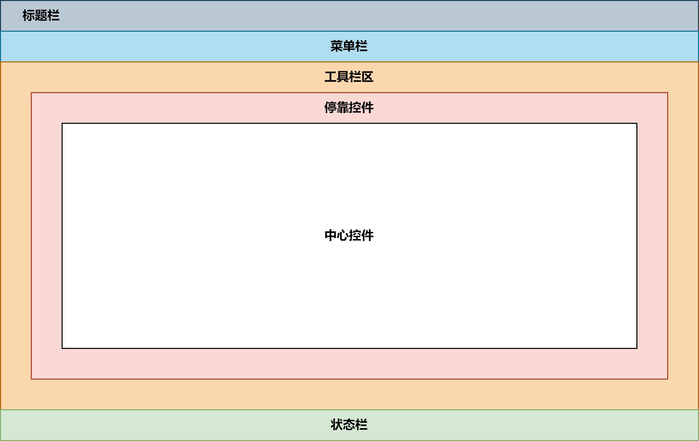

# Notes 笔记

**QT框架功能描述** <p>
QT 框架中的模块分为两大类:
- ***QT基本模块(Qt Essentials) :*** 提供了 Qt 在所有平台上的基本功能
- ***QT附加模块(Qt Add-Ons) :*** 实现了一些特定功能的模块

| 模块 | 描述 |
| :-: | :-: |
| `Qt Core` | Qt 框架的核心, 定义了元对象系统 |
| `Qt GUI` | 设计 GUI 界面的基础类, 包括事件处理、文字处理等 |
| `Qt Widgets` | 提供用于创建 GUI 的各种界面组件类 |
| `Qt D-Bus` | D-Bus 是用于实现进程间通信(Inter Process Communication, IPC) 和 远程过程调用(Remote Procedure Call, RPC)的一种通信协议 |
| `Qt Test` | 提供一些对应用程序和库进行单元测试的类 |
| `Qt QML` | 提供用 QML 编程的框架, 定义了 QML 和基础引擎 |
| `Qt Quick` | 用于开发 QML 应用程序的标准库, 提供创建 UI 的一些基本类型 |
| `Qt Quick Controls` | 提供一套基于 Qt Quick 的控件,可用于创建复杂的UI |
| `Qt Quick Dialogs` | 提供通过 QML 使用系统对话框的功能 |
| `Qt Quick Layouts` | 提供用于管理界面布局的QML类型 |
| `Qt Quick Test` | 提供 QML 应用程序的单元测试框架 |

**Object 类**
- **元对象 (Meta Object) :** 每个 QObject及其子类的实例都有一个元对象 (静态变量 staticMetaObject)  函数 `metaObject()` 可以返回它的指针
- **类型信息 :** QObject的 `inherits()` 函数可以判断继承关系 
- **动态翻译 :** 函数 `tr()` 返回一个字符串的翻译版本
- **对象树 :** 表示对象间从属关系的树状结构 QObject 提供了 `parent()`、`children()`、`findChildren()` 等函数, 当对象树中的某个对象被删除时, 它的子对象也将被删除
- **信号和槽 :** 对象间的通信机制 
- **属性系统 :** 可以使用宏 `Q_PROPERTY` 定义属性, QObject 的`setProperty()` 会设置属性的值或定义动态属性; `property()`函数会返回属性的值

**QT 父窗口**
- 创建控件时, 可以指定停靠在某个父窗口上面, 这时控件将作为子窗口被束缚在其父窗口的内部, 并伴随父窗口一起移动、隐藏、显示和关闭; 否则该控件将作为独立窗口显示在屏幕上, 且游离于其它窗口之外
- QWidget及其子类的对象可以做为其它控件的父窗口常用的父窗口类有如下三个
  - `QWidget`
  - `QMainWindow` 主窗口, QWidget的直接子类
  - `QDialog` 对话框, QWidget的直接子类
- 父窗口的析构函数回自动销毁其所有的子窗口对象, 因此即使子窗口对象是通过 `new` 操作符动态创建的, 可以不显式的执行 `delete` 操作, 而且不用担心内存泄漏的问题, 只要保证父窗门对象被正确销毁, 其子窗口也将随之被销毁
- 设置窗口的位置和大小
  - `void move(int x, int y);`
  - `void resize(int x, int y);`

---

**QT 信号与槽**
- 什么是信号和槽
  - 信号和槽是 QT 自定义的一种通信机制, 实现对象之间的数据交互
  - 当用户或系统触发了一个动作, 导致某个控件的状态发生了改变, 该控件就会发射一个信号, 即调用其类中一个特定的成员函数(信号), 同时还可能携带有必要的参数
  - 槽和普通的成员函数几乎没有太多区别, 可以是公有的、保护的或私有的, 可以被重载也可以被覆盖, 其参数可以是任意类型, 并可以像普通成员函数一样调用
  - 槽函数与普通成员函数的差别并不在于其语法特性, 而在于其功能, 槽函数更多体现为对某种特定信号的处理, 可以将槽和其它对象信号建立连接, 这样当发射信号时, 槽函数将被触发和执行, 进而来完成具体功能 
- **信号的定义**
  ```
  class X : public QObject {    // X 类必须派生自 QObject 类, 或其子类
                                // 可以是 QObject 的子类, 也可以是其子类的子类
      Q_OBJECT                  // 使用信号与槽机制必须添加 Q_OBJECT 宏
  signals:                      // 不需添加任何访问修饰符
      void signal_func(...);    // 信号函数
  };
  ```
  ***注意 :*** 信号函数只需要声明, 不能写定义
- **槽函数的定义**
  ```
  class X : public QObject {
      Q_OBJECT
  public slots:
      void slot_func(...) { ... }   // 槽函数
  };
  ```
  ***注意 :*** 槽函数可以连接到某个信号上, 当信号被发射时, 槽函数将被触发, 另外槽函数也可以被当作普通的成员函数被直接调用
- 信号与槽的连接 <p>
  `QObject::connect(const QObject* sender, const char* signal, const QObject* receiver, const char* method);`
  - 参数
    - `sender` 信号发送的对象指针
    - `signal` 要发送的信号函数, 可以用 `SIGNAL(...)` 宏进行类型转换
    - `receiver` 信号的接收对象指针
    - `method` 接收信号后要执行的槽函数, 可以使用 `SLOT(...)` 宏进行类型转换
- 信号与槽连接的语法要求
  - 信号与槽参数要一致 <p>
    `QObject::connect(A, SIGNAL(sigfunc(int)), B, SLOT(slotfunc(int)));` **-> 正确** <p>
    `QObject::connect(A, SIGNAL(sigfunc(int)), B, SLOT(slotfunc(int, int)));` **-> 错误**
  - 可以有缺省参数 <p>
    `QObject::connect(A, SIGNAL(sigfunc(int)), B, SLOT(slotfunc(int, int = 0)));` **-> 正确**
  - 信号函数的参数可以多于槽函数, 多余的参数将被忽略
    `QObject::connect(A, SIGNAL(sigfunc(int, int)), B, SLOT(slotfunc(int)));` **-> 正确**
- 信号与槽连接的应用
  - 一个信号可以被连接到多个槽 <p>
    `QObject::connect(A, SIGNAL(sigfunc(int)), B1, SLOT(slotfunc1(int)));` <p>
    `QObject::connect(A, SIGNAL(sigfunc(int)), B2, SLOT(slotfunc2(int)));`
  - 多个信号可以被连接到一个槽  <p>
    `QObject::connect(A1, SIGNAL(sigfunc1(int)), B, SLOT(slotfunc(int)));` <p>
    `QObject::connect(A2, SIGNAL(sigfunc2(int)), B, SLOT(slotfunc(int)));`
  - 两个信号可以直接连接(信号级连) - 了解即可 <p>
    `QObject::connect(A1, SIGNAL(sigfunc1(int)), A2, SIGNAL(sigfunc2(int)));`

---

**面向对象的 QT 编程** <p>
***基于对象的 QT 编程***
- 完全不使用任何面向对象技术, 而只是利用Qt所提供的类创建对象, 并诉用对象的接口以满足用户的需求是可能的, 但这样构建的应用程序其功能必然是十分有限的
- 首先, Qt类保护成员中的诸多实现无法在类的外部被复用, Qt试图通过多态实现的很多机制, 如事件处理, 完全无法使用
- 再次, Qt提供的信号和槽不可能满足用户所有的需求, 自定义信号和槽需要面向对象技术
- 最后, Qt Designer、Qt Creator等工具链都在以面向对象的方式使用Qt, 不能反其道而行之

---

**QT Designer (QT 设计师)**
- 在指定目录下输入 `designer` 进入 QT Designer, 进入 QT Designer 后可以进行可视化的 UI 编辑, 当成功布局好 UI 后按住 `ctrl + S` 进行重命名保存
- 使用 `uic` 进行编译, 将 XML 文件转换为 C++ 头文件
- 使用头文件中自动生成的界面相关代码, 完成代码编写
  - **方法 1:** 通过继承方式, 将界面相关代码继承过来直接使用
  - **方法 2:** 通过组合方式, 添加一个界面类的成员变量(ui), 通过该成员访问界面相关的代码, 实际开发中, 推荐这种方法

---

**QT Creator (QT 创造器)**
- 在任意目录下, 执行 `qtcreator` , 进入 QT 集成开发环境界面(Windows 下需要将对应的环境变量进行添加)
- 在欢迎界面选择 "New Project" 创建新项目

---

**QT 事件**
- 事件的概念
  - 在Qt中, 是以事件驱动 UI工具集, 包括信号与槽都依赖于 Qt 的事件处理机制
  - 通常事件是由窗口系统或者 Qt 自身产生的, 用以响应所发生的各类事情, 比如用户按下并释放了键盘或者鼠标、窗口因缩放而需要重绘、定时器到期而应有所动作
  - 如下图可以看到事件比信号更原始, 一个下压式按钮首先感受到的是鼠标事件, 在进行必要的处理以产生按钮下沉继而弹起的视觉效果之后, 才会发射 `clicked()` 信号


- **如何处理事件**
  - 在 Qt 中, 事件被封装成对象, 所有的事件对象类型都继承自抽象类 `QEvent` , 当事件发生时, 首先被调用的是 `QObject` 类中的虚函数`event()` , 其参数 `QEvent` 标识了类型
  - 在 Qt 桌面应用(Qt Widgets Application)开发中, QWidget类覆盖了其基类中的 `event()`, 并根据具体事件调用具体事件处理函数:
    - `void QWidget::mousePressEvent(QMouseEvent* e);` 鼠标按下事件
    - `void QWidget:mouseReleaseEvent(QMouseEvent* e);` 鼠标抬起事件
    - `void QWidget::mouseMoveEvent(QMouseEvent* e);` 标移动事件
    - `void QWidget::paintEvent(QPaintEvent* e);` 绘图事件
  - **所有的事件处理函数都是虚函数**, 可以被 QWidget 的子类覆盖, 以提供针对不同窗口控件类型的事件处理, 控件的使用者所关心的往往是定义什么样的槽处理什么样的信号, 而控件的实现者则更关心覆盖哪些事件处理函数
  - 如果程序员希望在窗口中自定义的处理事件, 可以**继承 QWidget** 或者其子类, 比如**QDialog、QMainWindow** , 在自定义的窗口子类中重写事件处理函数, 当相应事件被触发时, 会利用多态的语法机制, 所执行到的事件处理函数将是子类中重写的版本, 从而实现程序员想要的事件处理效果

---

**QT 常用事件** <p>
***绘图事件***
- 通过绘图事件, 可以实现自定义的图像绘制, 当有下列情况之一发生时, 将触发窗口的绘制事件, 即 **QWidget** 类的 `paintEvent()` 虚函数会被调用:
  - 窗口被创建以后第一次显示出来
  - 窗口由隐藏状态转变为可见状态
  - 窗口由最小化状态转变为正常或最大化状态
  - 窗口因尺寸大小的变化需要呈现更多的内容
  - **QWidget** 类的 `update()/repaint()` 成员函数被调用
- 如果希望在自己的窗口中显示某个图像, 在 **QWidget** 的窗口子类中可以重写绘图事件函数 `paintEvent` , 在其中可用 **QPainter(Qt二维图形引擎)** 实现指定的**图像绘制、渲染**等操作

***定时器事件***
- Qt 通过两套机制为应用程序提供定时功能
  - 定时器事件, 由 `QObject` 提供
  - 定时器信号, 由 `QTimer` 提供
- 通过定时器事件实现定时器
  - `int QObject:startTimer(int interval);` 启动定时器, 以后每隔 `interval` 毫秒触发一次定时器事件, **返回定时器 ID**
  - `void QObject::timerEvent(QTimerEvent*);` **虚函数** , 定时器事件处理函数
  - `void QObject::killTimer(int id);` 关闭参数 `id` 所标识的定时器

***鼠标事件***
- `QWidget` 类定义了以下虚函数提供对鼠标事件的处理, 其参数 `QMouseEvent` 描述了鼠标事件的细节, 如发事件的鼠标按键、鼠标所在位置等
  - `virtual void mousePressEvent (QMouseEvent* e);` 鼠标按下
  - `virtual void mouseReleaseEvent(QMouseEvent* e);` 鼠标抬起
  - `virtual void mouseDoubleClickEvent(QMouseEvent* e);` 鼠标双击
  - `virtual void mouseMoveEvent(QMouseEvent* e);` 鼠标移动

***键盘事件***
- `QWidget` 类定义了以下虚函数提供对键盘事件的处理, 其参数 `QKeyEvent` 描述了键盘事件的细节, 如引发事件的键盘按键文本等
  - `virtual void keyPressEvent (QKeyEvent* e);` 按键按下
  - `virtual void keyReleaseEvent(QKeyEvent* e);` 按键抬起

---

**混合方式 UI 设计** 
- 可视化 UI 设计无需人工编写代码区处理大量繁琐的界面组件的创建和布局管理工作, 可以直观地进行界面设计, 大大提高工作效率, **但某些组件无法可视化地添加到界面上 ( 例如状态栏、工具栏的部分功能等 )**
- 采用纯代码方式进行 UI 设计虽然无所不能, 但是设计效率太低, 过程非常繁琐
- 混合方式创建UI, 即部分界面设计用UI设计器可视化实现, 部分无法在 UI 设计器里实现的界面设计用代码实现

***主窗口***
- `QMainWindow` 是一个为用户提供主窗口程序的类, 包含一个菜单栏多个工具栏、多个停靠控件、一个状态栏以及一个中心控件, 是许多应用程序(如文本编辑器、图片编辑器等)的基础
- Qt主窗口界面布局如下图
  
- 主窗口具有自己的布局管理器因此不允许在主窗口上设置或创建布局管理器, 但是在中心控件上可以设置
- **菜单栏**
  - 菜单是一系列命令的列表, 为了实现菜单、工具栏按钮、键盘快捷方式等命令的一致性, **QT 使用动作(Action)来表示这些命令**
  - Qt 的菜单就是由一系列的 **QAction 动作对象** 构成的列表
  - 菜单栏是包含菜单的面板, 位于主窗口标题栏的下面一个主窗口只能有一个菜单栏
- **工具栏**
  - 工具栏是由一系列的类似于按钮的动作排列而成的面板, 它通常由一些经常使用的命令(动作)组成
  - 工具栏位于菜单栏的下面、状态栏的上面, 可以停靠在主窗口的上下左右四个方向
  - 一个主窗口可以包含多个工具栏
- **状态栏**
  - 位于应用程序底部, 用于显示应用程序状态的一些信息
- **QAction**
  - `QAction` 类提供了抽象的用户界面 *action* , 这些 *action* 可以被放置在窗口控件
  - `QAction` 可以被添加到菜单和工具栏中, 并且可以自动保持在菜单和工具栏中的同步。
  - `QAction` 是可以作为独立的对象被创建, 也可以在构建菜单时创建
  - `QAction` 可以包含一个*图标* 、*菜单文本* 、*快捷键* 、*状态文本* 等
  - 只有将 `QAction` 添加到窗口控件上, 才可以使用这些 `QAction`

---

**常用 UI 设计控件** <p>
***常用输入显示控件***
- QLabel
- QLineEdit
  - QLabel 用于显示字符串, QLineEdit 用于显示和输入字符串, 这两个类都有如下两个函数用于读取和设置显示字符串:
    - `QString text() const`
    - `void setText(const QString &)`
- QSpinBox
- QDoubleSpinBox
  | 属性名称 | 描述 |
  | :-: | :-: |
  | prefix | 数字显示的前缀, 例如 '$', 前缀不会被获取, 仅作显示的效果 |
  | suffix | 数字显示的后缀, 例如 'kg', 后缀不会被获取, 仅作显示的效果 |
  | minimum | 数值范围的最小值, 如 0 |
  | maximum | 数值范围的最大值, 如 255 |
  | singlestep | 步长, 点击右侧上下调整按钮时的单步改变值, 如 1、0.1 等 |
  | value | 当前显示的值, 不包含前缀 |
  | displayIntegerBase | QSpinBox 特有的属性, 显示整数使用的进制, 如 2 表示而进制 |
  | decimals | QDoubleSpin 特有的属性, 显示数值的小数位置, 如 2 显示两位小数 |

***日期时间和日历控件***
- 日期时间类型
  - QTime : 时间数据类型, 仅表示时间, 如: 15:23:20
  - QDate : 日期数据类型, 仅表示日期, 如: 2023-08-16
  - QDateTime : 日期时间数据类型, 表示日期和时间, 如 2023-08-16 15:23:20
- 日记时间控件
  - QTimeEdit : 编辑和显示时间的控件
  - QDateEdit : 编辑和显示日期的控件
  - QDateTimeEdit : 编辑和显示日期时间的控件
  - QCalendarWidget : 一个用日历形式选择日期的控件
- QCalendarWidget 日历控件
  - 信号
    - `void QCalendarWidget::selectionChanged()`

***QComboBox***
- 下拉列表框控件类
- 提供一个下拉列表供用户选择, 也可以直接当作一个 `QLineEdit` 用作输入
- 每个项(item, 或称列表项)可以关联一个 `QVariant` 类型的变量, 用于存储一些**不可见数据**
  - 在某些情况下, 我们可能希望将更多的数据与每个选项相关联, 例如一个整数、一个自定义对象等; 可以使用 `QVariant` 来保存和传递这些额外的数据
  - 可以使用 `QVariant` 构造函数将数据包装成 `QVariant` 对象, 然后使用 `addItem()` 函数将带有相关数据的选项添加到 `QComboBox` 中
  - 在需要访问选定的选项及其关联的数据时, 可以使用 `currentData()` 函数获取与选定选项相关联的 `QVariant` 数据
    ```
    // 演示如何在 QComboBox 中添加带有相关数据的选项, 并使用 QVariant 来检索数据
    #include <QApplication>
    #include <QComboBox>
    #include <QDebug>

    int main(int argc, char *argv[]) {
        QApplication app(argc, argv);

        QComboBox comboBox;

        // 添加带有相关数据的选项
        int intValue = 42;
        QString stringValue = "Hello, QVariant!";
        QVariant variantInt(intValue);
        QVariant variantString(stringValue);

        comboBox.addItem("Option 1", variantInt);
        comboBox.addItem("Option 2", variantString);

        // 获取当前选中项的数据
        QVariant currentData = comboBox.currentData();
        if (currentData.canConvert<int>()) {
            int selectedInt = currentData.toInt();
            qDebug() << "Selected Int:" << selectedInt;
        } else if (currentData.canConvert<QString>()) {
            QString selectedString = currentData.toString();
            qDebug() << "Selected String:" << selectedString;
        }
        comboBox.show();
        return app.exec();
    }
    ```
  - `QVariant` 是一个非常通用的类型, 几乎所有类都能转换为 `QVariant` , 类似于 `union` 联合 , 然后再通过 `toX` 函数转换为原类型
- 常用函数
  - 添加项 <p>
    `void addItem(const QString& text, const QVariant& userData = QVariant())` <p>
    `void addItem(const QIcon& icon, const QString& text, const QVariant& userData = QVariant())`
  - 访问项 <p>
    **返回当前项的序号, 从 0 开始 :** `int currentIndex()` <p>
    **返回当前项的文字 :** `QString currentText()` <p>
    **返回当前项的关联数据 :** `QVariant currentData(int role=Qt::UserRole)` <p>
    **返回指定索引号的项的文字 :** `QString itemText(int index)` <p>
    **返回指定索引号的项的关联数据 :** `QVariant itemData(int index, int role=Qt::UserRole)` <p>
    **返回项的个数 :** `int count()`
  - 常用信号 <p>
    `void currentIndexChanged(int index)` <p>
    `void currentIndexChanged(const QString& text)`

***QPlainTextEdit***
- 用于编辑多行文本的编辑器, 可以编辑普通文本
- `QPlainTextEdit` 提供 `cut()`、`copy()`、`paste()`、`undo()`、`redo()`、`clear()`、`selectAll()` 等标准功能的槽函数, `QPlainTextEdit` 还提供一个标准的右键快捷菜单
- `QPlainTextEdit` 常用函数
  - 添加项字符串 <p>
    `QPlainTextEdit::appendPlainText(const QString& text)`
  - 读取所有文字
    `QString QPlainTextEdit::toPlainTextEdit() const`
  - 逐行读取需要使用 `QTextDocument` 类<p>
    `QTextDocument* QPlainTextEdit::document() const` <p>
    `int QTextDocument::blockCount()` <p>
    `QTextBlock QTextDocument::findBlockByNumber(int blockNumber)`
- 常用信号 <p>
  **为信号生成槽函数, 在槽函数中生成 QPlainTextEdit 的标准右键菜单** `customContextMenuRequested()`
- 自定义的右键菜单需要手动设置, 在 `QPlainTextEdit` 控件的 `contextMenuPolicy` 属性中设置值为 `Qt::CustomContextMenu` 可以将指定的自定义右键菜单进行显示
- 需要注意的是, 右键菜单显示的时候需要指定位置, 我们一般不使用默认的位置, 而是希望该位置和我们期待的位置重合

***QListWidget***
- QT 中用于项 (Item) 处理的组件有两类 :
  - **Item Views (包括 QListView、QTableView、QTreeView)**
  - **Item Widgets(包括 QListWidget、QTableWidget、QTreeWidget)**
- QListWidget 提供一个基于 *项* 的列表控件
- 常用函数
  - 添加项 <p>
    `void addItem(const QString& label)` <p>
    `void addItem(QListWidgetItem* item)` <p>
    `void addItems(const QStringList& labels)`
  - 插入项 <p>
    `void insertItem(int row, QListWidgetItem* item)` <p>
    `void insertItem(int row, const QString& label)` <p>
    `void insertItems(int row, const QStringList& labels)` <p>
  - 删除项 <p>
    `QListWidgetItem* takeItem(int row)` 按照行号删除相应的项, 需要注意的是, 该函数只是再控件列表中将该项移除, 在内存中并没有移除, 我们需要手动通过 `delete` 移除
  - 获取项 <p>
    `QListWidgetItem* item(int row) const`
    `QListWidgetItem* itemAt(const QPoint& p) const`
    `QListWidgetItem* itemAt(int x, int y) const`
  - 常用信号 <p>
    `void currentItemChanged(QListWidgetItem* current, QListWidgetItem* previous)` <p>
    `void currentRow(int currentRow)`
- QListWidgetItem 是 QListWidget 中的一个项

***QToolButton***
- 使用 `void QToolButton::setDefaultAction(QAction* action)` 来实现 `QToolButton` 和 `QAction` 之间的关联

***QSplitter***
- 可以用于分割两部分控件

---

**QT Model/View 模型**
- **Model/View** 结构是 QT 中用户界面组件显示与编辑数据的一种结构
  - View(视图) 是显示和编辑数据的界面组件
  - Model(模型) 是视图与原始数据之间的接口
- GUI 应用程序的一个很重要的功能是由用户在界面上编辑和修改数据, 典型的**如数据库应用程序** , 在数据库应用程序中, 用户在界面上执行各种操作, 实际上是修改了界面组件相关的数据库内的数据
- **将界面组件与所编辑的数据分离开来 , 又通过数据源的方式连接起来** , 是处理界面与数据的一种较好的方式
- Model/View 的基本结构如图:
  
  - **数据(Data) :** 实际的数据, 可能在内存中, 可能在文件中, 也可能在数据库中
  - **视图(View) :** 屏幕上的**界面组件**
  - **模型(Model) :** 与实际数据通信, 并为视图组件提供数据接口
  - **代理(Delegate) :** 可以让用户定制数据的界面和编辑方式
- 模型、视图和代理之间使用信号与槽通信
  - 源数据发生变化时, 模型发射信号通知视图组件
  - 用户再界面操作数据时, 视图发射信号
  - 编辑数据时, 代理发射信号告知模型和视图编辑器目前的状态
- **模型**
  
  - 抽象类不能直接使用, 需要子类继承来实现一些纯虚函数, QT 提供了一些模型类用于项数据处理, 常见的几个类如下表所示——
    | Model 类 | 用途 |
    | :-: | :-: |
    | QStringListModel | 用于处理字符串列表数据的数据模型类 |
    | QStandardItemModel | 标准的基于项数据的数据模型类, 每个项数据可以是任何数据类型 |
    | QFileSystemModel | 计算机上文件系统的数据模型类 |
    | QSortFilterProxyModel | 用于数据库SQL查询结果的数据模型类 |
    | QSqlQueryModel | 用于数据库SQL查询结果的数据模型类 |
    | QSqlTableModel | 用于数据库的一个数据表的数据模型类 |
    | QSqlRelationalTableModel | 用于关系型数据表的数据模型类 |
- **视图**
  
  - 视图组件(View) 就是现实数据模型的数据的界面组件, QT 提供的视图组件如下——
    | View 类 | 用途 |
    | :-: | :-: |
    | QListView | 用于显示单列的列表数据, 适用于一维数据的操作 |
    | QTreeView | 用于显示树状结构数据, 适用于树状结构数据的操作 |
    | QTableView | 用于显示表格状数据, 适用于二维表格型数据的操作 |
    | QColumnView | 用多个 QListView 显示树状层次结构, 树状结构的一个层用一个 QListView 显示 |
    | QHeaderView | 提供行表头活列表头的视图组件, 如 QTableView 的行表头和列表头 |
  - QListWidget、QTableWidget、QTreeWidget 是其基类的简便类, 适用于数据量
  - 通过 `setModel()` 函数设置视图
- **代理**
  
  - 代理就是在视图组件上为编辑数据提供编辑器
  - 代理负责从数据模型获取相应的数据, 然后显示在编辑器里, 修改数据后, 又将其保存到数据模型中
  - **QAbstractItemDelegate** 是所有代理类的基类, 作为抽象类, 它不能直接使用, 它的一个子类 **QStyledItemDelegate**, 是 QT 的视图组件缺省使用的代理类
  - 对于一些特殊的数据编辑要求, 可以从 **QStyledItemDelegate** 继承创建自定义代理类
- **相关概念**
  - 数据模型的基本结构
    
  - 模型索引
    - **`QModelIndex`** 表示模型索引的类
    - 模型索引提供数据存取的一个临时指针, 用于通过数据模型提取或修改数据
  - 行号和列号
    - 表格数据模型中的三个数据项 A、B、C , 获取其模型索引的代码是: <p>
      `QModelIndex indexA = model->index(0, 0, QModelIndex())` <p>
      `QModelIndex indexB = model->index(1, 1, QModelIndex())` <p>
      `QModelIndex indexC = model->index(2, 1, QModelIndex())`
  - 父项
    - 树状数据模型, 节点 A 和 节点 C 的父节点是顶层节点, 获取模型索引的代码是: <p>
      `QModelIndex indexA = model->index(0, 0, QModelIndex())` <p>
      `QModelIndex indexC = model->index(2, 1, QModelIndex())` <p>
    - 节点 B 的父节点是节点 A, 节点 B的模型索引由以下代码生成: <p>
      `QModelIndex indexB = model->index(1, 0, indexA)`
  - 项的角色 (enum Qt::ItemDataRole)
    - `DisplayRole` 数据是现实的字符串
    - `DecorationRole` 是用于装饰显示的属性
    - `ToolTipRole` 定义了鼠标的提示信息

**模型类 —— QFileSystemModel**
- QFileSystemModel 提供了一个可用于访问本机文件系统的数据模型
- QFileSystemModel 和视图结合使用, 可以显示本机上的文件系统
- 常用函数
  - `QString rootPath() const`
  - `bool isDir(const QModelIndex& index) const`
  - `QString filePath(const QModelIndex& index) const`
  - `QString fileName(const QModelIndex& index) const`
  - `QString type(const QModelIndex& index) const`
  - `qint64 size(const QModelIndex& index) const`
  - ...

**模型类 —— QStringListModel**
- `QStringListModel` 用于处理字符串列表的数据类型, 他可以作为 `QListView` 的数据模型, 在界面上显示和编辑字符串列表
- 常用函数
  - `void setString(const QStringList& string)`
  - `bool insertRows(int row, int count, const QModelIndex& parent = QModelIndex)`
  - `bool removeRows(int row, int count, const QModelIndex& parent = QModelIndex)`
  - `bool setData(const QModelIndex& index, const QVariant& value, int role = Qt::EditRole)`

**模型类 —— QStandardItemModel**
- **QstandardltemModel** 是标准的以项数据 (Item Data) 为基础的标准数据模型类
- 通常与 **QTableView** 组合成 **Model/View** 结构, 实现通用的二维数据的管理功能
- 每个项是一个 **QStandardltem** 类的变量, 用于存储项的数据、字体格式、对齐方式等
- ***相关类***
  - **QTabelView**
    - 二维数据表视图组件
    - 有多个行和多个列, 每个基本显示单元是一个单元格
    - 通过 `setModel()` 函数设置一个 `QStandardItemModel` 类的数据模型
    - 一个单元格显示 `QStandardItemModel` 数据模型中的一个项
  - **QItemSelectionModel**
    - 一个用于跟踪视图组件的单元格选择状态的类
    - 当在 `QTabelView` 中选择某个单元格或多个单元格时, 通过 `QItemSelectionModel` 可以获得选中的单元格的模型索引, 为单元格的选择提供方便
- ***几个类的关系***
  - `QTableView` 是界面视图组件
  - 其关联的的数据模型是 `QStandardItemModel`
  - 关联的项选择模型是 `QItemSelectionModel`
  - `QStandardItemModel` 的数据管理的基本单元是 `QStandardItem`

