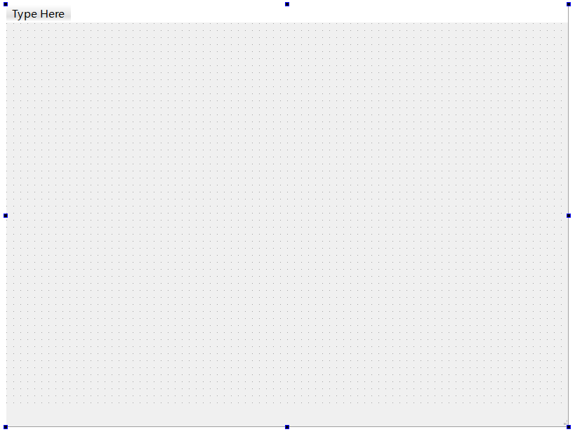
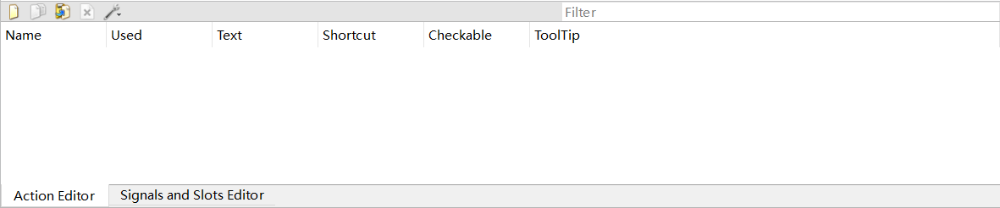
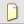
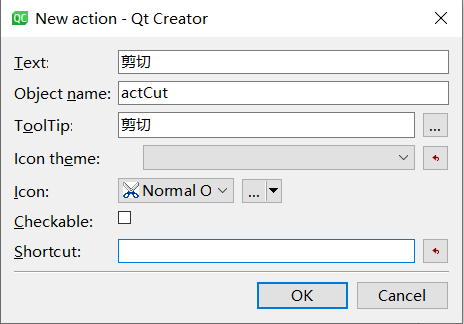
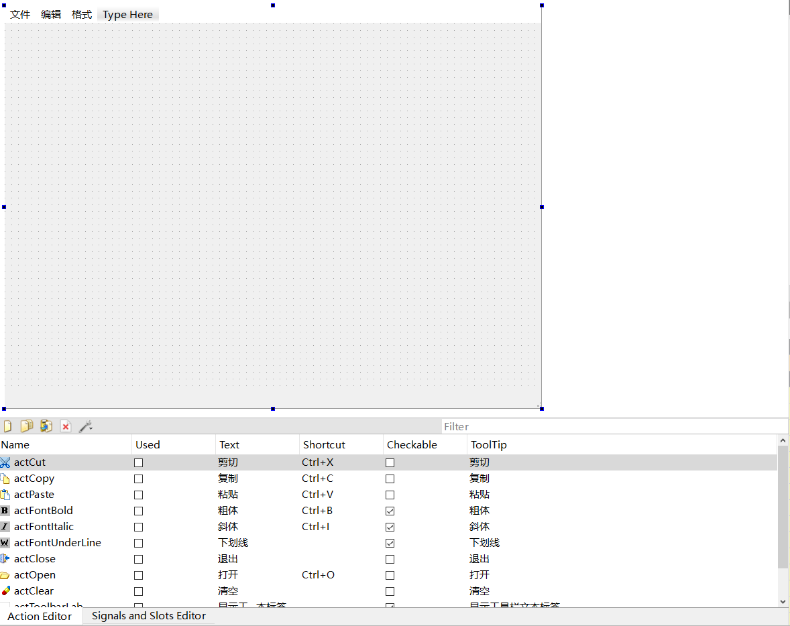
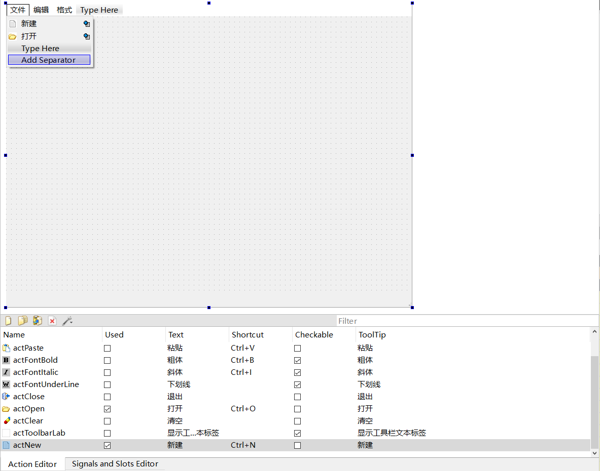
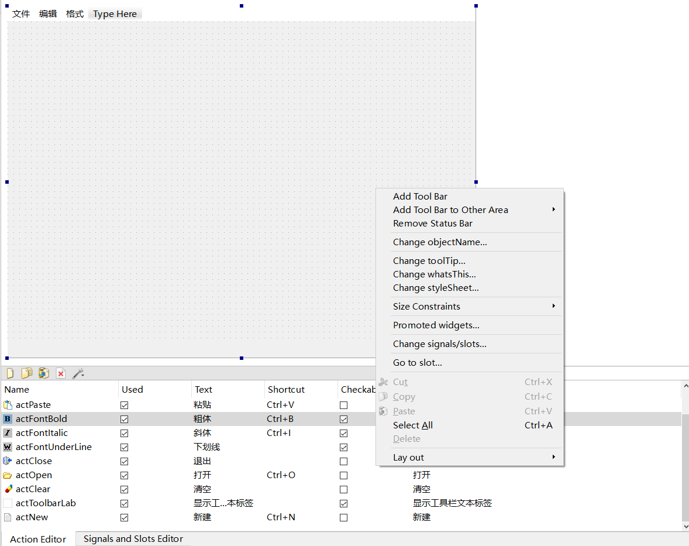
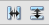

## Hello

编译过程(以 `Hello` 为例):
1. `qmake -project` 生成 `Hello.pro` 文件
2. `vi Hello.pro` 修改 `Hello.pro` 文件, 添加相应的模块
3. `qmake` 生成 `Makefile` 文件
4. `make` 生成可执行程序 -> Windows下可以使用 `mingw32-make`

需要注意添加 `qmake` 的环境变量, `MinGW` 的环境变量

## Close
初识信号与槽

## Slider_SpinBox
初识 滑块(QSlider) 和 选值框(QSpinBox), 使用信号与槽机制保持同步
- `QSlider`
  - `void setRange(int min, int max);` 设置滑动范围
  - `void valueChanged(int)` 滑块滑动时发送信号(信号函数)
  - `void setValue(int)` 设置当前位置(槽函数)
- `QSpinBox`
  - `void setRange(int min, int max)` 设置数值改变范围
  - `void valueChanged(int)` 选值框数值改变时发送信号(信号函数)
  - `void setValue(int)` 设置当前数值(槽函数)

## SumCalculator
实现加法器, 了解面向对象的 QT 编程
- 输入两个数字, 按 "=" 按钮显示计算结果
- 两个操作数必须都是合法的数字, 拒绝接受任何非法字符
- 两个操作数必须全部合法, "=" 按钮才被激活, 否则禁用(不可以点击)
- 显示结果的控件只可查看不可修改, 但支持复制到剪贴板
- 所有子窗口的大小和位置随主窗口的缩放自动调整至最佳

## GetSysTime
获取系统时间, 使用面向对象的 Qt 编程技术创建获取时间窗口
- 点击按钮, 通过自定义的槽函数获取时间并显示到标签
- 发送自定义信号

## SumCalculator_useDesigner
使用 Designer 实现加法器布局, 了解使用 `uic` 的编译过程: <p>
`uic SumCalculator.ui -o ui_SumCalculator.h`

## Login
使用 Designer 设计登录对话框
- 了解 `lineEdit` 控件的 `echoMode` 属性, 可以防止密码明文显示
- 了解 `QDialogButtonBox` 按钮组控件, 其包含两个按钮, 当按下"确定"按钮发送 `accepted()` 信号, 当按下"取消"按钮则发送 `rejected()` 信号
- 了解 `QMessageBox` 控件, `criticla()` 函数的使用
- 点击 "OK" 按钮判断输入用户名或密码是否正确
- 如错误弹出信息提示框, 可以重新登录
- 点击 "Cancel" 按钮, 则退出登录 
- 自动连接信号与槽, 槽函数命名规则 `on_控件名_信号函数名(参数列表)` , 例如 `on_buttonBox_accept(void)`

## SumCalculator_useCreator
使用 Creator 重构加法器实例
- 在任意目录下, 执行 `qtcreator` , 进入 QT 集成开发环境界面
- 在欢迎界面选择 "New Project" 创建新项目

## ShowImages
了解绘图事件, 实现一个简单的图片展示器
- 了解 QT Resources(.qrc) 文件 的添加和使用
  - `Prefix` 前缀, 可以随意选择, 产生一个逻辑路径
  - 使用资源时, 需要加一个 `:` , 例如前缀为 `/` , 添加了一个 `image` 文件夹, 当加载图片资源时可以采用 `QImage image(":/image/..")` 的方式
- 了解窗口的 `sizePolicy` 尺寸策略属性, 包含 `Preferred` 完美的(可以理解为平分策略), `Expanding` 尽量伸展

## ShowImagesRandom
了解定时器事件, 实现一个简单的随机图片展示器

## MouseTest
了解鼠标事件, 实现一个简单的鼠标测试功能, 可以进行使用鼠标控件移动标签控件的操作

## KeyTest
了解键盘事件, 实现通过键盘方向键控制 label 方块移动

## MainWindow
使用 混合UI设计 完成一个简单的文本编辑器
- 了解主窗口、菜单栏、工具栏、状态栏
- 在 QT 中创建 **MainWindow** , `menubar` 表示菜单栏, `statusbar` 表示状态栏
  
  图中顶部 **"Type Here"** 是指菜单栏, 底部有部分没有点格的部分是状态栏
- **Action** 可以在 QT 中可视化的添加
   <p>
  选择左上角的图标  进行 **新建Action**

  
  **`Text`** 文本 <p>
  **`Object name`** 名称 <p>
  **`ToolTip`** 提示文本 <p>
  **`Icon theme`** 图标样式 <p>
  **`Icon`** 图标 <p>
  **`Checkable`** 可选的, 类似于斜体、加粗这种选中后可以长期保持的可以使用 `Checkable` 参数 <p>
  **`Shortcut`** 快捷键
- 设计 `Action`
- 设计菜单和工具栏
  
  1. 设计菜单时可以选择新建菜单的方式进行设计, 首先选择 **"Type Here"**修改菜单栏, 此处已经设计了**文件、编辑和格式**三部分
  2. 点击**文件、编辑和格式**三部分的任意一个部分后可以展开菜单, 可以选择新建菜单项进行设计
  3. 但是大多数情况下不会选择上述操作方式, 一般情况下, 构建好 **"Action"** 后直接使用拖拽的方式加入对应的部分进行绑定
    
    使用 **"Add Separator"** 可以在菜单项之间添加分隔符(一条横线)
  4. 在窗口任意部分右键, 选择 **"Add Tool Bar"** 添加工具栏
    
- 代码构建其他界面控件
  - 状态栏上添加控件: <p>
    `void QStatusBar::addWidget(QWidget* widget, int stretch = 0)`
  - 工具栏上添加控件: <p> 
    `QAction* QToolBar::addWidget(QWidget* widget)`
- 实现 **Action** 功能
  - 部分 **Action** 可用可视化方式实现, 直接使用可视化信号与槽机制实现, 最常用的信号函数 `triggered(void)/triggered(bool)` , 表示触发, 其中带有 `bool` 参数的和带有 **可选** 参数的 **Action** 搭配使用, 当选中时, `bool` 参数变为 `true`
  - 无法用 可视化 **Action** 实现的则使用手写代码实现的方式来完成
- 为应用程序添加图标
  1. 可在 **.pro** 文件中加入语句 `RC_ICONS = xxx.ico`
  2. 可在 **.ui** 文件中设置 **windowIcon** 属性

## SpinBox
了解 **QSpinBox** 和 **QDoubleSpinBox**

## DateTime
实现一个显示日期时间的界面
- `calendarPopup` 属性选中可以弹出日历界面, 在此可以选择日期, 但是无法选择时间, 因此虽然时间也有该属性, 但是实际上是无效的, 只因为他们继承自同一个基类

## ComboBox_PlainTextEdit
了解 **QComboBox** 控件 和 **QPlainTextEdit** 控件
- QComboBox 可以通过可视化的方式直接添加简单项目, 常用于可选项非常固定的情况
- QComboBox 也可以通过代码方式添加简单项
  ```
  for(int i = 0; i < 20; i++) {
      ui->cmbSimple
        ->addItem(icon, QString::asprintf("Item %d", i));
  }
  ```
  ```
  QStringList list;
  list << "北京市" << "上海市" << "天津市" << "重庆市"<< "河北省";
  ui->cmbSimmple->addItems(list);
  ```
- 了解创建右键菜单的方法

## ElecClock
实现一个简单的电子时钟

## MultipleControls
- 使用 QTabWidget 设计多页界面
- 使用 QToolBox 设计多组工具箱
- 使用 QSplitter 设计分割条, 实现可以分割的界面
  - 在 QT 中按住 `Ctrl` 选中两个控件后, 无需进行相关布局
  - 选择  可以在相应的部分加入一个分割条, 前者加入一条垂直分割线, 后者加入一条水平分割线
- 创建 Actions, 用 Actions 设计主工具栏, 用 Action 关联 QToolButton 按钮
  - 使用 `void QToolButton::setDefaultAction(QAction* action)` 来实现 `QToolButton` 和 `QAction` 之间的关联
- 使用 QListWidget, 创建和添加项, 为项设置图标和复选框, 遍历列表进行选择
- QListWidget 的主要信号 currentItemChanged() 功能, 编写相应槽函数
- 为 QListWidget 控件创建自定义快捷菜单


